<!-- .slide: data-background="../reveal.js/img/bg-1.png" -->
<!-- .slide: class="title" -->
</br></br>
<h1 style="text-align: left; font-size: 80px;">Working with FeatureLayers in the ArcGIS API for JavaScript</h1>
<p style="text-align: left; font-size: 30px;">Bjorn Svensson and Anne Fitz</p>
<p style="text-align: left; font-size: 30px;">slides: <a href="https://git.io/Jfipd"><code>https://git.io/Jfipd<code></a></p>

----
<!-- .slide: data-background="../reveal.js/img/bg-3.png" -->
</br></br></br>

### First time using the ArcGIS API for JavaScript?

#### Watch [Getting Started with Web Development and the ArcGIS API for JavaScript](https://www.youtube.com/watch?v=zQTkkFUhzLI) to understand the basics, then come back to this presentation!

<< add shortened link here >>

----
<!-- .slide: data-background="../reveal.js/img/bg-3.png" -->
### Agenda

- Adding a FeatureLayer
- Visualization
  - Rendering
  - Clustering
  - Highlight features
  - Filtering
- Labeling
- Querying
- Editing Features

----

### What's so special about FeatureLayers?

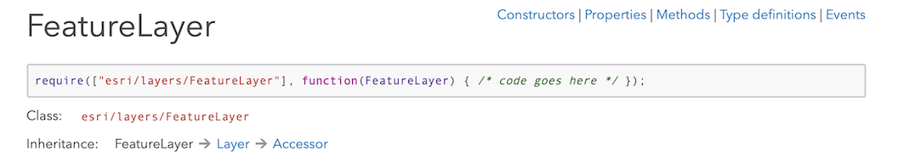

- Works with your data as features
- Can be rendered in 2D or 3D
- Can be used for editing
- Updates to data are automatically available to client
- Allows for dynamic styling and interactive workflows
- Support for client-side filtering, querying, and statistics

----

### Adding a FeatureLayer to your map

**Sources**

- Feature services or map services
- Feature collections
- Portal item (from ArcGIS Online or Enterprise)

```js
const layer = new FeatureLayer({
  url: "https://<url to my server>/FeatureServer",
  // portalItem: {
  //    id: "item id from portal"
  // },
  renderer: { ... },
  popupTemplate: { ... },
});

map.add(layer);
```

----

### Adding a FeatureLayer to your map

<a href="Demos/demo1-intro/add-featurelayer.html" target="_blank">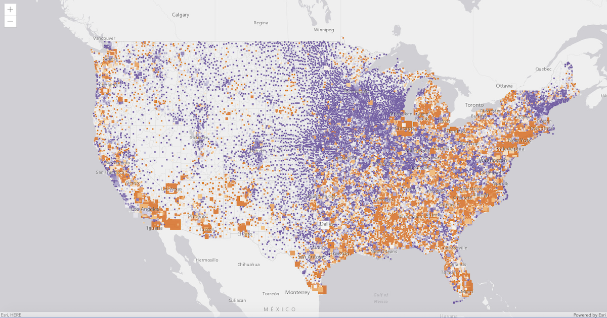</img></a>

----

### Adding a FeatureLayer to your map: definitionExpression

Restrict data retrieved from the feature service

- to work with a subset of features
- to remove features with null attributes.

```js
layer.definitionExpression = "STATE_NAME = 'California'";
```

<a href="Demos/demo1-intro/add-featurelayer.html" target="_blank">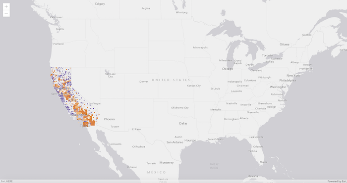</img></a>

----

<h3 style="margin-top:-35px"> Visualization: Rendering</h3>

<p style="margin:0">A renderer defines how the FeatureLayer is drawn.</p>

|[SimpleRenderer](https://developers.arcgis.com/javascript/latest/api-reference/esri-renderers-SimpleRenderer.html)| [ClassBreaksRenderer](https://developers.arcgis.com/javascript/latest/api-reference/esri-renderers-ClassBreaksRenderer.html)| [UniqueValueRenderer](https://developers.arcgis.com/javascript/latest/api-reference/esri-renderers-UniqueValueRenderer.html) |
|----------|----------|----------|
| [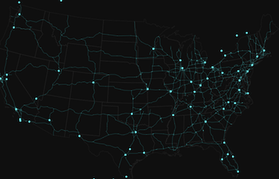](https://developers.arcgis.com/javascript/latest/sample-code/visualization-location-simple/index.html) | [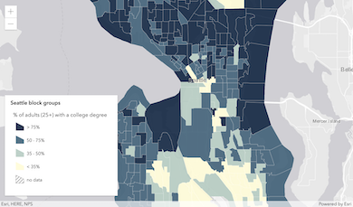](https://developers.arcgis.com/javascript/latest/sample-code/visualization-classbreaks/index.html) | [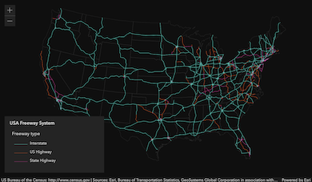](https://developers.arcgis.com/javascript/latest/sample-code/visualization-location-types/index.html) |

| [HeatmapRenderer](https://developers.arcgis.com/javascript/latest/api-reference/esri-renderers-HeatmapRenderer.html) | [DotDensityRenderer](https://developers.arcgis.com/javascript/latest/api-reference/esri-renderers-DotDensityRenderer.html) | [DictionaryRenderer](https://developers.arcgis.com/javascript/latest/api-reference/esri-renderers-DictionaryRenderer.html) |
|----------|----------|----------|
| [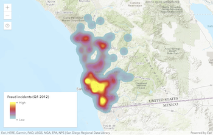](https://developers.arcgis.com/javascript/latest/sample-code/visualization-heatmap-scale/index.html) | [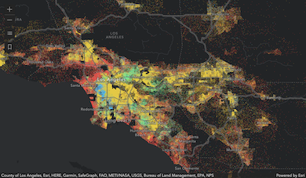](https://developers.arcgis.com/javascript/latest/sample-code/visualization-dot-density/index.html) | [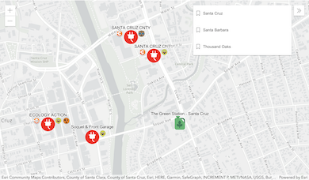](https://developers.arcgis.com/javascript/latest/sample-code/visualization-dictionary/index.html) |

----

### Visualization: Clustering

**Clustering:** a method of reducing points by grouping them into clusters based on their spatial proximity to one another.

<a href="https://developers.arcgis.com/javascript/latest/sample-code/featurereduction-cluster/index.html" target="_blank">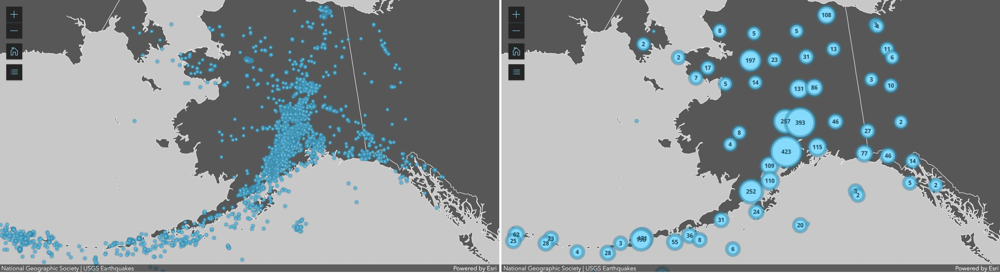</img></a>

----

### Visualization: Highlight

- Highlight features on the LayerView
- Maintain a handle to the current highlight
- Highlight options: color, opacity, halo

```js
if (highlight){
  highlight.remove();
}
highlight = layerView.highlight(result.features);
```

----

### Visualization: Filtering

- Define the filter criteria
- Emphasize and/or deemphasize features
- Define the style for filtered features
- Apply the filter to the LayerView

----

### Visualization demos

----

### Labeling

Label features to show relevant information at a glance.

----

### Labeling demos

----

### Querying

- Attribute queries
  - select only features passing a WHERE SQL clause
- Spatial queries
  - select only features passing a spatial filter
- Statistic queries
  - returns statistics about the selected features

----

### Server-side querying

Bring features from your data into the web browser.

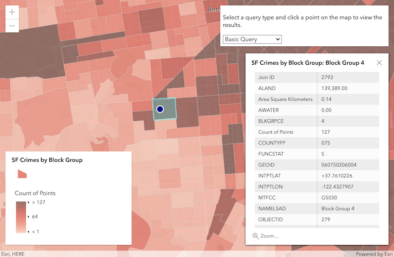</img>

[Query features](https://developers.arcgis.com/javascript/latest/sample-code/sandbox/index.html?sample=featurelayer-query-basic)

```js
layer.queryFeatures({
    geometry: point
}).then(function(featureSet){
    // do something with the results
});
```

[Query attachments](https://developers.arcgis.com/javascript/latest/sample-code/sandbox/index.html?sample=query-attachments)

```js
featureLayer.queryAttachments()
```

[Query related features](https://developers.arcgis.com/javascript/latest/sample-code/sandbox/index.html?sample=query-related-features)

```js
featureLayer.queryRelatedFeatures()
```

----

### Client-side querying

Query data already in the web browser.

- Really fast
- Avoids round-trips to the server
- Only works with available features
- Make sure you have all the attributes you need

----

### Querying demos

----

### Editing

Updating features directly from the web browser.

How do I know if I can edit features?

- Rest supported operations
- ArcGIS Online/Portal settings
- ArcGIS Server manager
- FeatureLayer.capabilities

----

### Editing

- FeatureLayer.applyEdits()
- Editor widget
- FeatureTable widget

----

### Editing demos

----

### 2020 DevSummit Technical Sessions

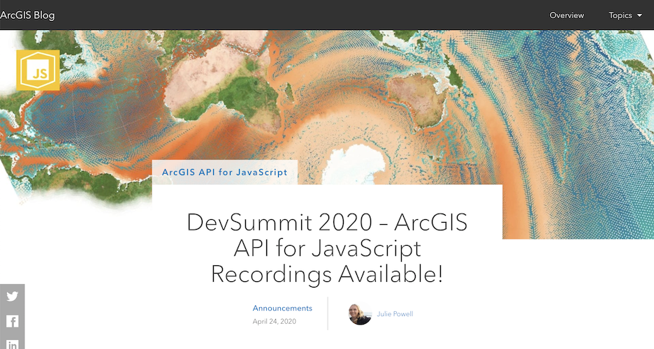

28 videos focused on developing with the JS API!
<a href="https://esriurl.com/ds2020jsblog"><code>https://esriurl.com/ds2020jsblog<code></a>

----
<!-- .slide: data-background="../reveal.js/img/bg-5.png" -->