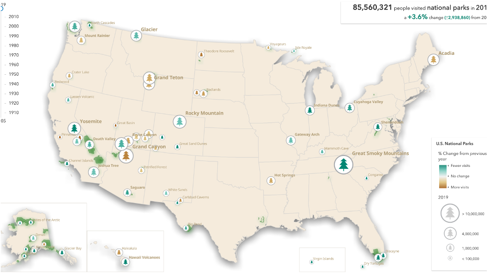
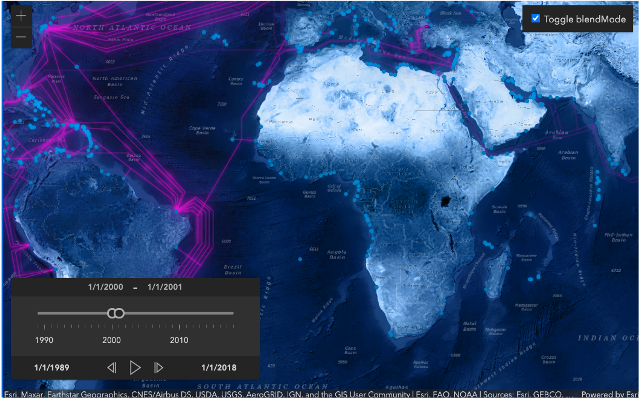
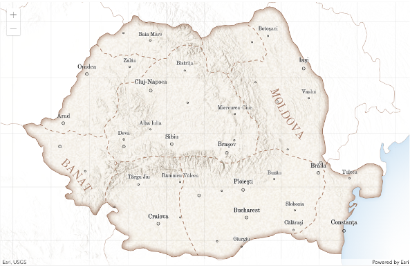
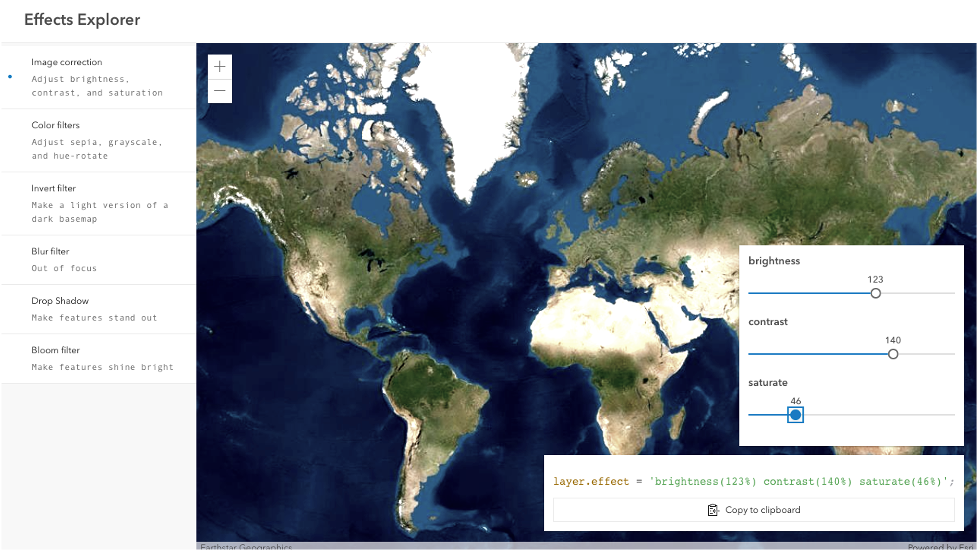
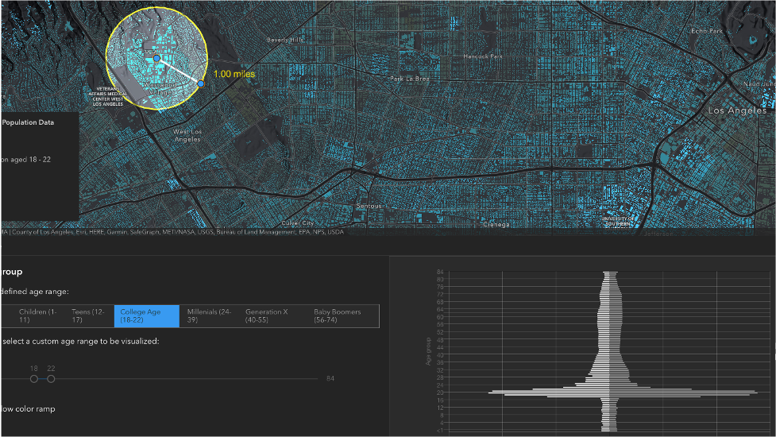

# ArcGIS API for JavaScript: Amazing Mapping Apps

length: 60 min

presenters: Jeremy Bartley, Anne Fitz

Tuesday, July 13, 2021  
7:15 am - 8:15 am PST

Streaming Live

## Description

The ArcGIS API for JavaScript lets you build powerful, interactive mapping applications. Learn how you can turn your raw data into information that tells a story with dynamic, data-driven visualizations. This session will show you how you can use various visualization techniques and interactivity to create amazing applications. 

## Slides

- [Presentation - Download the slides](https://github.com/annelfitz/UC-presentations/raw/master/UC-2021/amazing-mapping-apps/slides.pdf)

## Demos

- [National Park Explorer](https://ekenes.github.io/national-park-visits/?viewType=all&variable=percent-change&year=2020)
   - [Source code](https://github.com/ekenes/national-park-visits)

- [Submarine cables](https://ubatsukh.github.io/arcgis-js-api-demos/devsummit2021/submarine-cables/)
   - [Source code](https://github.com/ubatsukh/arcgis-js-api-demos/tree/master/devsummit2021/submarine-cables)

- [Map of Romania](https://ralucanicola.github.io/JSAPI_demos/romania-regions/index.html)
   - [Source code](https://github.com/RalucaNicola/JSAPI_demos/tree/master/romania-regions)

- [Effects explorer](https://musing-curran-b8a4ea.netlify.app/2021-devsummit/arcgis-api-for-javascript-photoshop-style-graphics-effects-for-your-layers-and-data/demos/effect-explorer/)
   - [Source code](https://github.com/ycabon/presentations/tree/gh-pages/2021-devsummit/ArcGIS-API-for-JavaScript-Photoshop-style-Graphics-Effects-for-Your-Layers-and-Data/demos/effect-explorer)

- [Age and Income in Los Angeles](https://annelfitz.github.io/DevSummit-presentations/DS-2021/plenary/age-income-in-LA/)
   - [Source code](https://github.com/annelfitz/DevSummit-presentations/tree/main/DS-2021/plenary/age-income-in-LA)  

## Resources

- [ArcGIS API for JavaScript Documentation](https://developers.arcgis.com/javascript/latest/)
- [Styles and data visualization guide pages](https://developers.arcgis.com/javascript/latest/visualization/)
- [ArcGIS API for JavaScript blog posts](https://www.esri.com/arcgis-blog/?s=#&products=js-api-arcgis)
- [Esri Community](https://community.esri.com/t5/arcgis-api-for-javascript/ct-p/arcgis-api-for-javascript)
